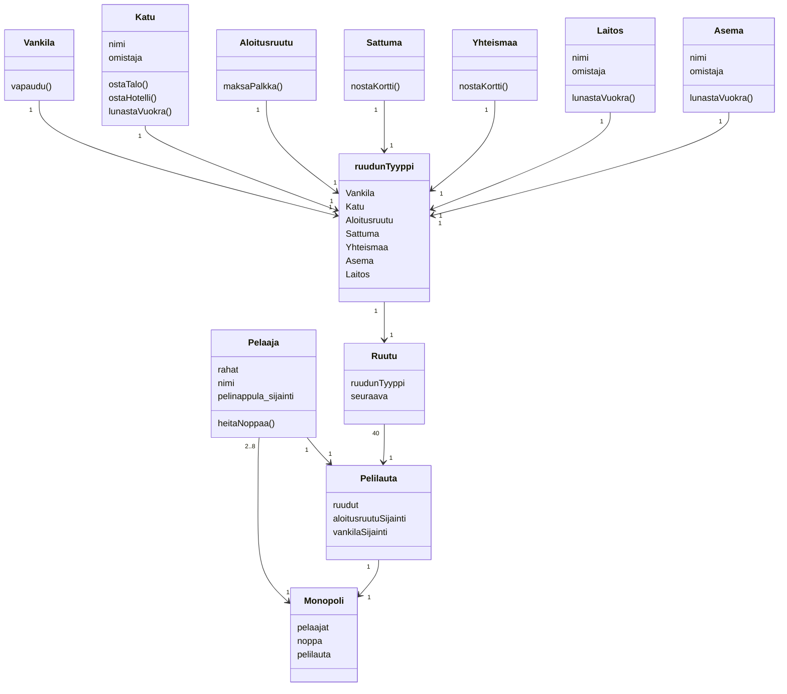

# Monopolikaavio

Pelissä on pelilauta, pelaajia ja 2 noppaa.
Pelilaudalla on 40 ruutua, joilla kullakin on oma tyyppinsä. Ruutu tietää, mikä on sitä seuraava ruutu.
Pelaajalla on yksi pelinappula, jonka sijainti on aina jokin pelilaudan ruutu.

